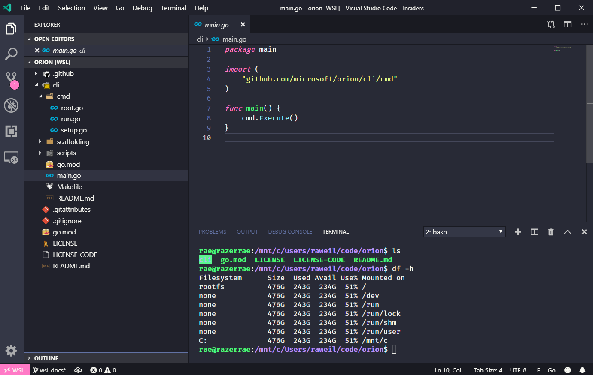

# Orion CLI

## Install the CLI

We use a simple script to download the latest release from the orion repo and move it to `/usr/local/bin/orion`. Download the installer script:

`curl -fsSL https://raw.githubusercontent.com/microsoft/orion/tree/master/cli/scripts/installer.sh -o installer.sh`

Inspect the installer to verify it does what you think. Now run the installer using this following command:

`./installer.sh`

Currently this only contains the start of the project structure, a test concept, Makefile and Readme. From a terminal, cd into the `cli` folder and run:

```make build```
```make run```
```make test```

We are currently only using go-cobra and go-testing packages just to get something committed. 

## Orion CLI Commands

List help commands:

```orion --help```

Setup template in current directory:

```orion setup --template "bedrock/azure-simple"```

> The flag `--template` is specified using the following structure:
>
> `[github repo name]/[orion template name]`

Test the current template in current directory:

```orion run --docker```

## Orion Usage
1. Create project dir: my_orion_proj
2. `cd` to my_orion_proj
3. Run `orion setup --template "orion/azure-simple"`
4. Follow prompts for cloud provider info

```
ianphil@afropro.local [~/src/tmp/my_orion_proj]
> tree -a
.
├── .env
├── infra
│   └── templates
│       └── azure-simple-hw
│           ├── backend.tf
│           ├── main.tf
│           ├── outputs.tf
│           ├── provider.tf
│           ├── test
│           │   └── integration
│           │       └── azure_simple_integration_test.go
│           └── variables.tf
```

## Optional: Install WSL Extension for VS Code

The recommended IDE for Orion use and development is [VS Code](https://code.visualstudio.com) with the WSL (Windows Subsystem for Linux) extension. VS Code is an open-source, cross-platform IDE. The WSL extension allows developers to use, develop, and debug Linux-specific applications from an integrated terminal window inside VS Code.

 - [Install VS Code for Windows, Mac, or Linux](https://code.visualstudio.com/)
 - [Install the WSL extension for VS Code](https://code.visualstudio.com/docs/remote/wsl).

The Extensions tab in VS Code contains additional extensions for Go, Azure Terraform, and more.



