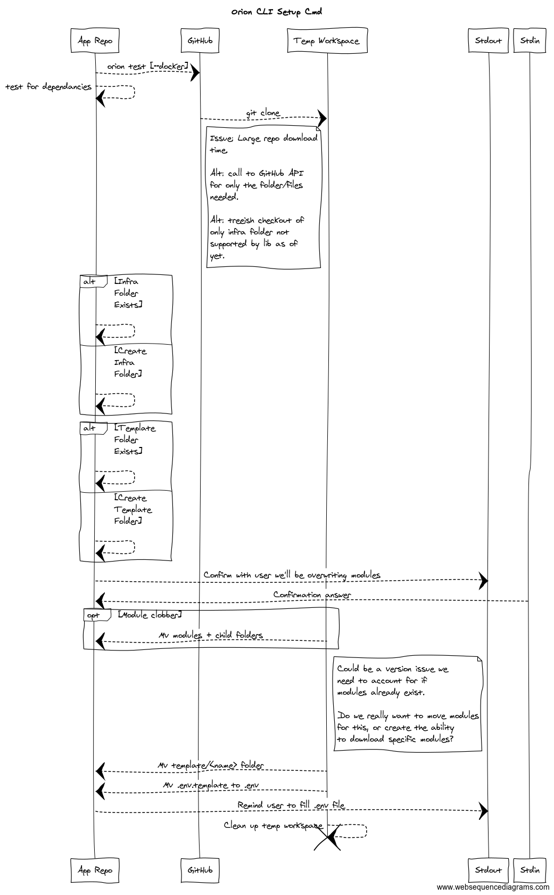
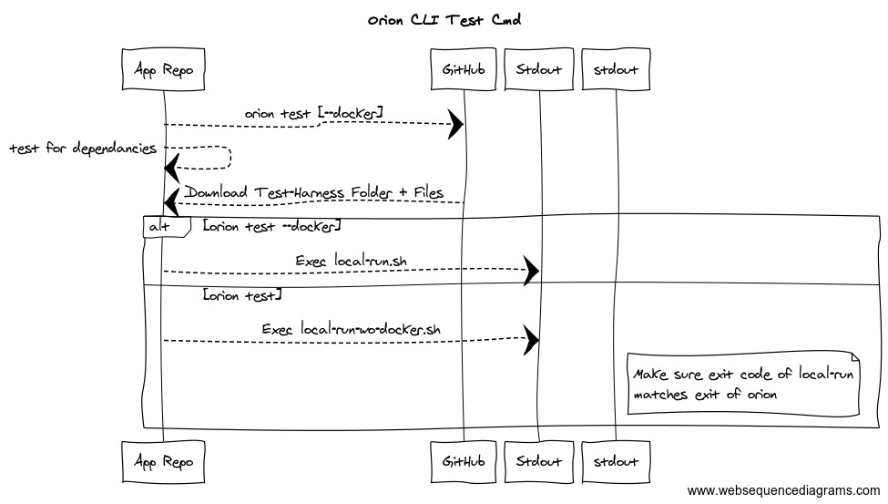
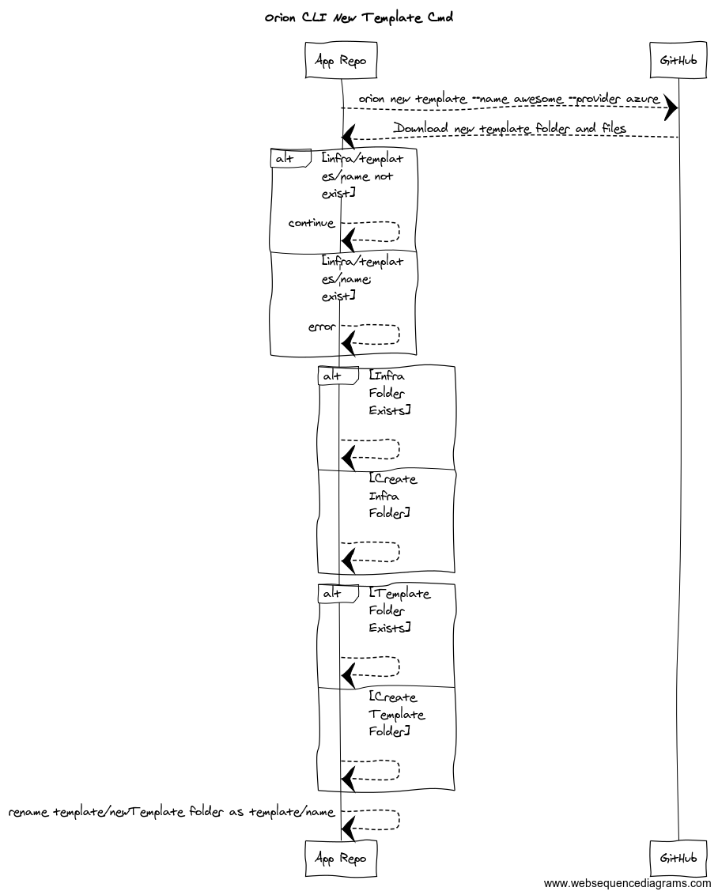
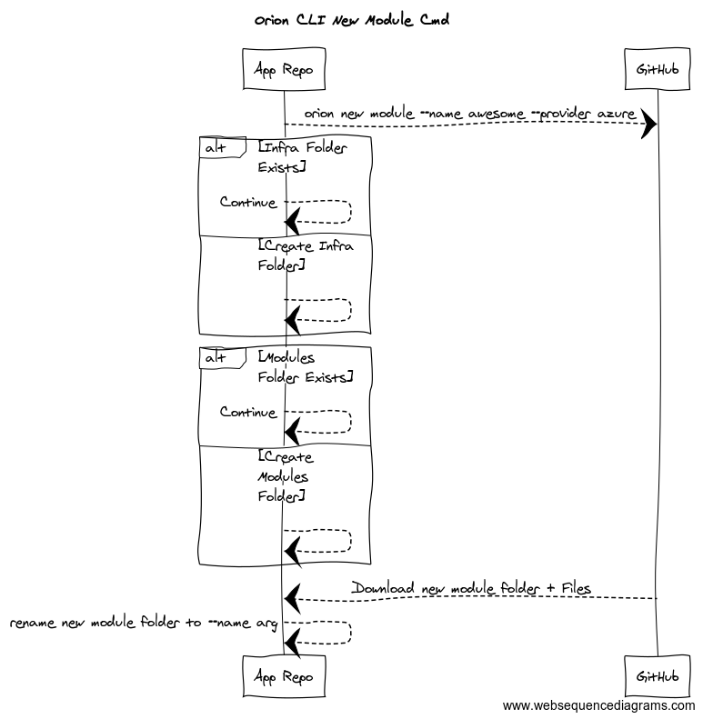

# Orion Commands - Sequence Diagrams

We're using [Web Sequence Diagrams](https://www.websequencediagrams.com/) to generate the diagrams shown below.

## Orion CLI Setup Command



```
title Orion CLI Setup Cmd


App Repo-->GitHub: orion test [--docker]
App Repo-->App Repo: test for dependancies
GitHub-->Temp Workspace: git clone
note right of GitHub
    Issue: Large repo download
    time.

    Alt: call to GitHub API 
    for only the folder/files
    needed.
    
    Alt: treeish checkout of 
    only infra folder not
    supported by lib as of 
    yet.
end note

alt Infra Folder Exists
    App Repo-->App Repo:
else Create Infra Folder
    App Repo-->App Repo:
end

alt Template Folder Exists
    App Repo-->App Repo:
else Create Template Folder
    App Repo-->App Repo:
end

App Repo-->Stdout: Confirm with user we'll be overwriting modules
Stdin-->App Repo: Confirmation answer

opt Module clobber
    Temp Workspace-->App Repo: Mv modules + child folders
end

note right of Temp Workspace
    Could be a version issue we
    need to account for if 
    modules already exist.
    
    Do we really want to move modules
    for this, or create the ability
    to download specific modules?
end note

Temp Workspace-->App Repo: Mv template/<name> folder
Temp Workspace-->App Repo: Mv .env.template to .env

App Repo-->Stdout: Remind user to fill .env file
Temp Workspace-->Temp Workspace: Clean up temp workspace
destroy Temp Workspace
```

## Orion CLI Test Command



```
title Orion CLI Test Cmd


App Repo-->App Repo: orion test [--docker]
App Repo-->App Repo: test for dependencies

App Repo-->GitHub: Request test files
GitHub-->App Repo: Download Test-Harness Folder + Files

alt orion test --docker
    App Repo-->Stdout: Exec local-run.sh
else orion test
    App Repo-->Stdout: Exec local-run-wo-docker.sh
    
note right of stdout
    Make sure exit code of local-run
    matches exit of orion
end note
```

## Orion CLI New Template Command



```
title Orion CLI New Template Cmd

App Repo-->GitHub: orion new template --name awesome --provider azure
GitHub-->App Repo: Download new template folder and files

alt infra/templates/name not exist
    App Repo-->App Repo: continue
else infra/templates/name: exist
    App Repo-->App Repo: error
end

alt Infra Folder Exists
    App Repo-->App Repo:
else Create Infra Folder
    App Repo-->App Repo:
end

alt Template Folder Exists
    App Repo-->App Repo:
else Create Template Folder
    App Repo-->App Repo:
end

App Repo-->App Repo: rename template/newTemplate folder as template/name
```

## Orion CLI New Module Command



```
title Orion CLI New Module Cmd

App Repo-->GitHub: orion new module --name awesome --provider azure

alt Infra Folder Exists
    App Repo-->App Repo: Continue
else Create Infra Folder
    App Repo-->App Repo:
end

alt Modules Folder Exists
    App Repo-->App Repo: Continue
else Create Modules Folder
    App Repo-->App Repo:
end

GitHub-->App Repo: Download new module folder + Files
App Repo-->App Repo: rename new module folder to --name arg
```